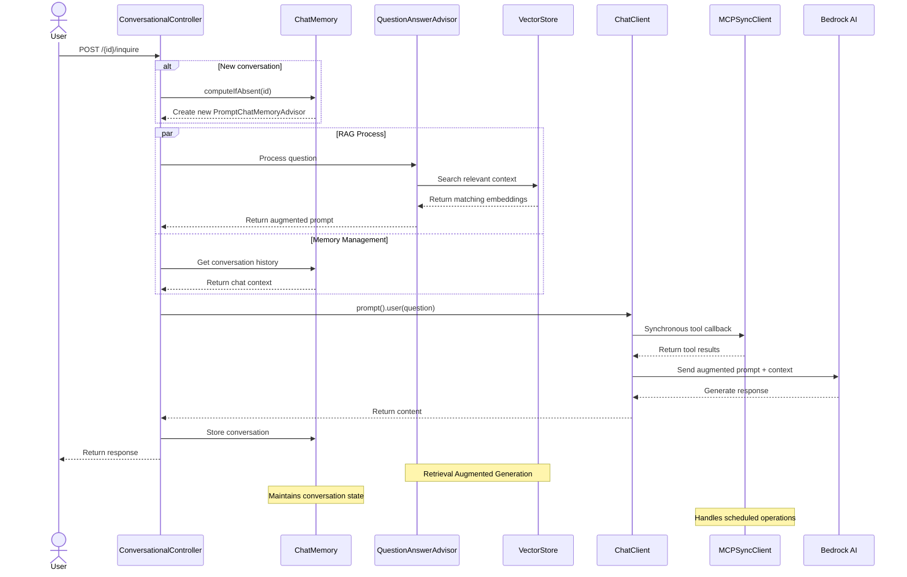

# Sample: Spring AI with Docker Model Runner and MCP

A Spring Boot application that provides an AI-powered dog adoption service using:
- Docker Model Runner for AI/ML capabilities
- Spring AI for conversation management
- PostgreSQL with pgvector for vector storage
- Two services:
    - Adoptions service: Handles dog adoption inquiries
    - Scheduling service: MCP Server that manages adoption appointments

_Note:_ This is a fork of the [sample app in AWS Samples](https://github.com/aws-samples/Sample-Model-Context-Protocol-Demos/tree/main)

## Architecture



## Setup

To run locally you will need:
- JDK 23 or higher
- Docker Desktop with Model Runner enabled

1. Pull the models used in this sample application into Docker Model Runner: 
```shell
docker model pull ai/mxbai-embed-large
docker model pull ai/qwen2.5:7B-Q4_K_M
```

Build the Scheduling MCP Server as a Docker container:
```
cd scheduling && ./mvnw spring-boot:build-image && cd ..
```

## Running

This sample includes tests and a "test" main application which will start the dependency services (postgres with pgvector and the scheduling MCP server) in Docker with Testcontainers.

First make sure you are in the `adoptions` directory:
```
cd adoptions
```

Run the tests:
```
./mvnw test
```

Run the "adoptions" server:
```
./mvnw spring-boot:test-run
```

With the server started you can now make requests to the server.
In IntelliJ, open the `resources/client.http` file and run the two requests.
Or via `curl`:
```
curl -X POST --location "http://localhost:8080/2/inquire" \
    -H "Content-Type: application/x-www-form-urlencoded" \
    -d 'question=Do you have any neurotic dogs?'
```

```
curl -X POST --location "http://localhost:8080/2/inquire" \
    -H "Content-Type: application/x-www-form-urlencoded" \
    -d 'question=fantastic. when could i schedule an appointment to adopt Prancer, from the London location?'
```
